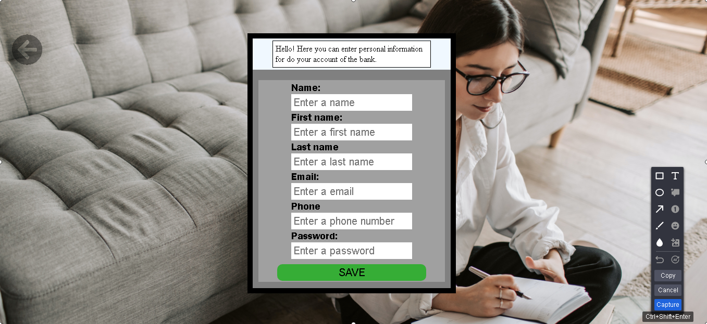
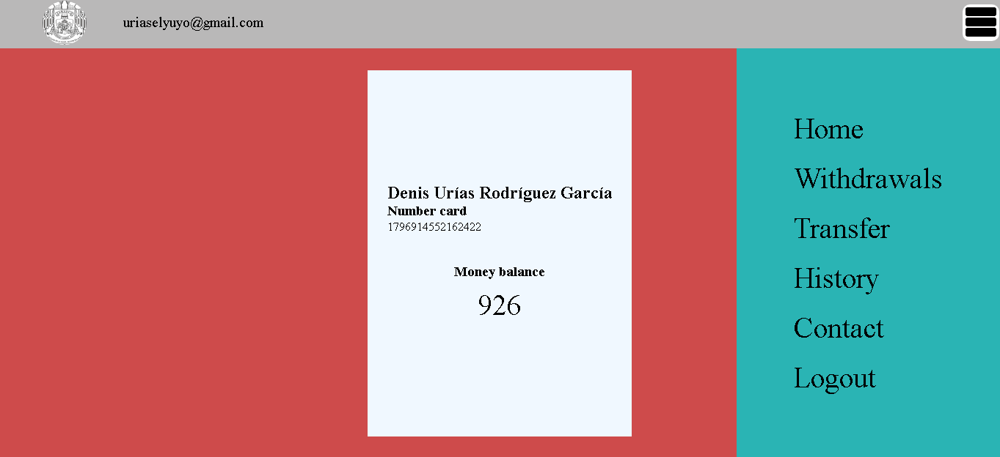
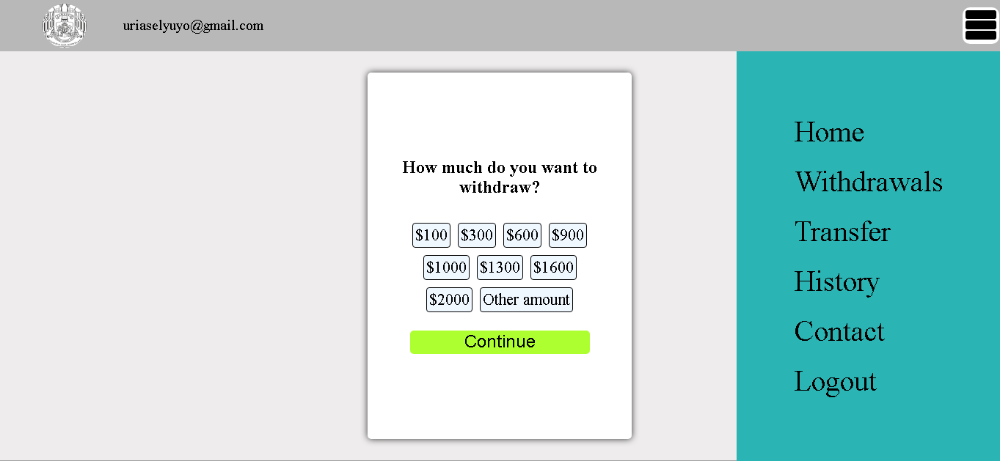
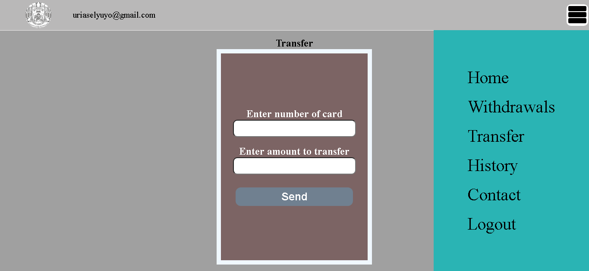
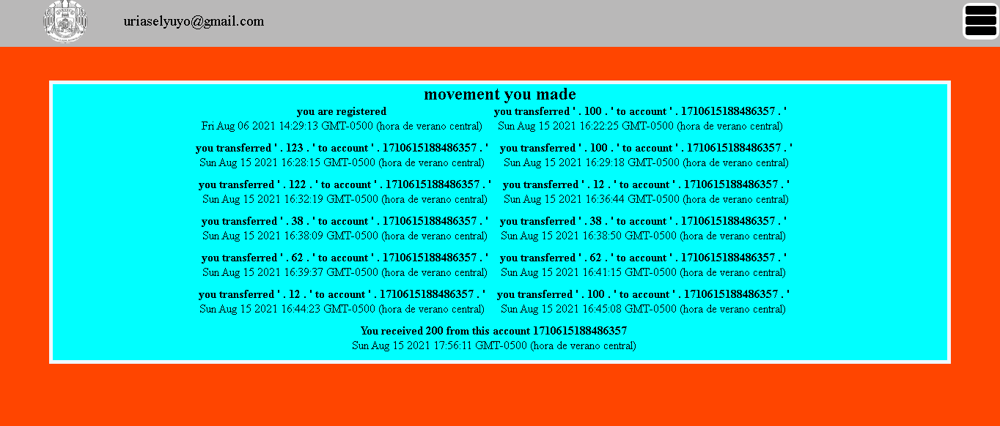
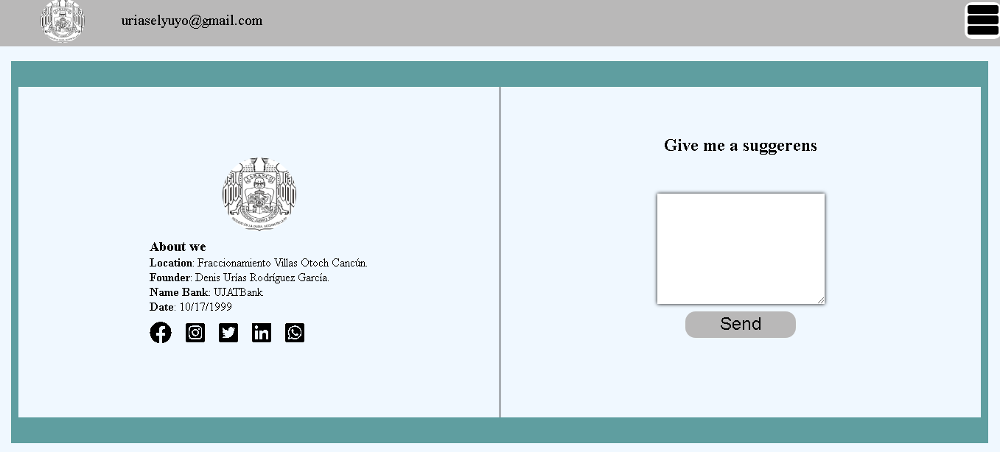

# system_banl.io
System bank with php, js, css and mysql.

<h4>This banking system has a login, where you can see that it only asks for two requirements: the phone number and password. It also has some verifications, these verifications are as follows: 1. number with a size of 10. 2. the password must match the number. 3. nothing can be done if you don't fill in all the spaces.</h4>

<h4>This part is the registration area, as you will see it asks for some personal information. We see that it asks for a name, surname, email, telephone number and password. This form has verifications that make the data not repeated or some data should not be entered. Verifications: 1. Mail verification, the mail must have an acceptable format.
2. It is impossible to add an email and phone number that is already in the database.
3. You have to fill in all the spaces if you want to save.
</h4>

<h4>Well, in this part we see that it shows the menu on one side, and it shows the user's information that information is: 1. Full name. 2. When you register a card number is created. 3. you see the balance.</h4>

<h4>This part is where the user will choose the amount they want to withdraw, it must be taken into account that if the client does not have a sufficient balance, the withdrawal will not be made.</h4>

<h4>
Well, this is the part of transferring money to another account. For that, you only ask for two things, the card number and the desired amount. If the card number does not exist in the database, the process will not be possible, and the desired amount should not exceed what you currently have.</h4>

<h4>In this part we will see all the movements you have made, whether it is withdrawing money and receiving money.</h4>

<h4>Finally, the footer is shown where you will see the information or contact of the bank, and on one side a form for customers to give their suggestion.</h4>

